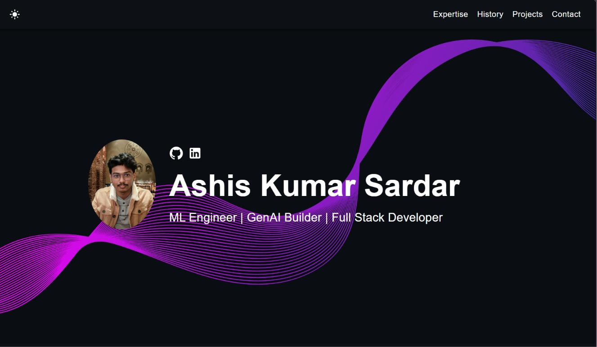

# Ashis Kumar Sardar Portfolio 🚀


## 🌐 Live Portfolio

👉 [View Portfolio](https://sardarbashis.github.io/ashis-portfolio/)

---

## 📌 About This Portfolio

This portfolio showcases my work, technical expertise, projects, and experience in:

- Machine Learning
- Generative AI
- Full Stack Development
- AI-powered applications
- MLOps & deployment workflows

The portfolio is fully responsive and designed with a modern UI to provide a smooth user experience across desktop and mobile devices.

---

## 🖼️ Preview



---

## ✨ Features

✅ Responsive & mobile-friendly design  
✅ Dark mode UI  
✅ Smooth scrolling navigation  
✅ Project showcase section  
✅ Career timeline section  
✅ Contact section  
✅ GitHub Pages deployment  
✅ Fully customizable React components  

---

## 🛠️ Tech Stack

- React
- TypeScript
- JavaScript
- SCSS
- Node.js
- GitHub Pages

---

## 📂 Featured Projects

### Smart Credit Risk Engine
AI-powered credit risk prediction system using Machine Learning and FastAPI.

### AI/ML Projects
Collection of ML, GenAI, and data-driven applications focused on real-world problem solving.

### Full Stack Applications
Modern web applications with scalable frontend/backend architecture.

---

## ⚡ Quick Setup

### 1. Clone Repository

```bash
git clone https://github.com/sardarbashis/ashis-portfolio.git
```

### 2. Navigate into Project

```bash
cd ashis-portfolio
```

### 3. Install Dependencies

```bash
npm install
```

### 4. Start Development Server

```bash
npm start
```

Open:

```txt
http://localhost:3000
```

---

## 🚀 Deployment

This portfolio is deployed using GitHub Pages.

### Deploy Command

```bash
npm run deploy
```

### Live URL

```txt
https://sardarbashis.github.io/ashis-portfolio/
```

---

## 📬 Connect With Me

### LinkedIn
👉 https://www.linkedin.com/in/ashiskumarsardar/

### GitHub
👉 https://github.com/sardarbashis

---

## ⭐ Support

If you like this portfolio, feel free to star the repository.

---

## 📄 License

This project is licensed under the MIT License.